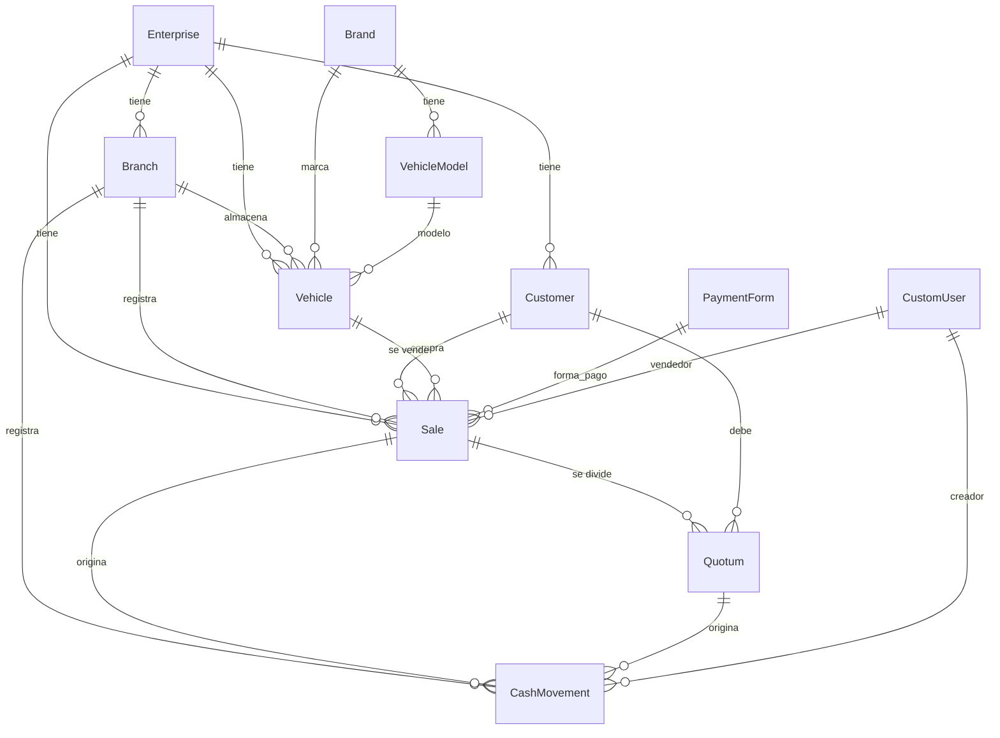

# Schema de la BD — AUTO OFERTAS

> Guía conceptual y técnica del modelo de datos. Empieza por la sección 1
> (mapa mental) si nunca tocaste el sistema, después saltá a la tabla que
> necesites de la sección 4.

---

## 1 — Mapa mental (1 minuto)

El negocio es: comprar vehículos (Japón / Corea) → traer a Paraguay →
vender en una playa → cobrar cuotas.

```
COMPRA               TRAÍDA              VENTA                     COBRANZA
─────────────────────────────────────────────────────────────────────────
Vehicle         →    Vehicle.state    → Sale (a un Customer)   → Quotum × N
(con costo FOB,      cambia a            (status=completed)        (cuotas que
container, etc.)     "available"         con N Quotum                vencen mes a mes)
                                         si es CRÉDITO
                                                                  CashMovement
                                                                  por cada cobro
                                                                  (kind=cobro_cuota,
                                                                   quota_id=Q.id)
```

Esa es la columna vertebral. Lo demás son detalles.

---

## 2 — Diagrama de relaciones



Si el cliente no se ve por GitHub, copiá el bloque a https://mermaid.live/

---

## 3 — Conceptos clave del negocio

### 3.1 Ciclo de vida del vehículo

```
in_transit (futuro: en contenedor/RORO)
   │
   ▼
available (en playa, listo para vender)
   │
   ├─→ reserved (Sale.status=pending)
   │      │
   │      ▼
   ├─→ sold (Sale.status=completed)
   │
   └─→ maintenance (en taller)
```

Hoy: solo `available`, `reserved`, `sold`, `maintenance`. Hay propuesta de
ampliar (ver `docs/design/VEHICLE_STATES_PROPOSAL.md`).

### 3.2 Ciclo de vida de la venta

```
pending (reserva con seña, contrato sin firmar)
   │
   ├─→ completed (contrato firmado, puede seguir cobrando cuotas durante meses)
   │
   └─→ cancelled (anulada, vehículo vuelve a available)
```

**Importante**: `Sale.status='completed'` ≠ "ya está cobrada toda". Una
venta a crédito vive con status=completed durante 2-3 años mientras se
cobran cuotas. El verdadero "cobrado al día" se calcula en línea con
`Sale.collection_status` (propiedad calculada).

### 3.3 Cuota — su estado y "vencido"

```
pending  ──(due_date pasa sin cobrar)──→  (calculado como overdue)
   │
   ▼ cobro
paid (status='paid' + payment_date seteado)
```

**Detalle sutil**: `status='overdue'` es legacy. La lógica nueva calcula
vencidas como `status='pending' AND due_date < hoy` dinámicamente. Ver
`Quotum.is_overdue` property.

### 3.4 Cuándo se crea un CashMovement

```
Sale.save() con status=completed Y payment_form=CONTADO  → CM kind='venta_contado'
Sale.save() con down_payment > 0                          → CM kind='seña_credito'
Quotum.save() con status=paid Y payment_date seteado      → CM kind='cobro_cuota'

(esto pasa automáticamente vía el método save() de cada modelo)

Manuales (cargados por usuario en /flujo-caja):
  - gasto_playa, alquiler, sueldo, compra_exterior, transporte, impuesto, ajuste, otro
```

---

## 4 — Tablas detalladas

### 4.1 `core_enterprise`
Empresa. Una sola fila por instancia del sistema.

| Campo | Tipo | Notas |
|---|---|---|
| `id` | INT PK | |
| `name` | varchar(100) | "AUTO OFERTAS" |
| ... otros opcionales | | |

### 4.2 `core_branch`
Sucursales. Hay 2: "CASA CENTRAL" y "SUCURSAL 1".

| Campo | Tipo | Notas |
|---|---|---|
| `id` | INT PK | |
| `enterprise_id` | FK → Enterprise | |
| `name` | varchar(100) | unique con enterprise |

### 4.3 `core_brand`
Marcas de vehículos.

| Campo | Tipo | Notas |
|---|---|---|
| `id` | INT PK | |
| `enterprise_id` | FK | |
| `name` | varchar | "TOYOTA", "KIA", "HYUNDAI", etc. |
| `is_active` | bool | |

### 4.4 `core_vehiclemodel`
Modelos por marca.

| Campo | Tipo | Notas |
|---|---|---|
| `id` | INT PK | |
| `brand_id` | FK | |
| `name` | varchar | "VITZ 1.3", "RACTIS 1.5", etc. |

### 4.5 `core_vehicle` 🚗 (clave)
Un vehículo físico.

| Campo | Tipo | Notas |
|---|---|---|
| `id` | INT PK | |
| `enterprise_id`, `branch_id` | FK | |
| `brand_id`, `model_id` | FK | |
| `year` | INT | 2008, 2012, etc. |
| `vin` | varchar(50) UNIQUE | "KSP130-2014508" — chasis |
| `license_plate` | varchar | Patente |
| `color` | varchar | |
| `mileage` | INT | Km |
| `fob` | Decimal(12,2) | Costo base USD |
| `container` | Decimal | |
| `dispatch` | Decimal | |
| `cam_vol` | Decimal | |
| `price` | Decimal | Precio de venta PYG |
| `currency` | varchar | 'PYG' o 'USD' |
| `state` | choice | `available` / `reserved` / `sold` / `maintenance` |

**Reglas**:
- `vin` es único globalmente
- `state` cambia automáticamente via `Sale.save()` hook (cuando una venta cambia status)
- Se aceptan VINs con caracteres alfanuméricos y guiones

### 4.6 `core_customer` 👤 (clave)
Cliente final.

| Campo | Tipo | Notas |
|---|---|---|
| `id` | INT PK | |
| `enterprise_id` | FK | |
| `is_generic` | bool | True para "cliente genérico" usado en ventas sin ficha |
| `first_name` | varchar(100) | |
| `last_name` | varchar(100) | |
| `document_type` | choice | 'ci', 'ruc', 'passport' |
| `document_number` | varchar(50) UNIQUE | CI o RUC |
| `email` | EmailField | |
| `phone` | varchar | |
| `address`, `city` | varchar | |
| `notes` | TextField | Notas internas — autoguardado |

**Reglas**:
- `(enterprise_id, document_number)` es único — un mismo doc no aparece 2 veces
- Patterns de duplicados conocidos (ver Patrón A y Patrón B en docs)
- Algunos `document_number` son placeholders ("DRV026-0008", "CUOTA000123") — son artefactos de migración

### 4.7 `core_paymentform`
Formas de pago: CONTADO, CREDITO, etc.

| Campo | Tipo | Notas |
|---|---|---|
| `id` | INT PK | |
| `name` | varchar(100) | "CONTADO", "CREDITO", "MIXTO" |
| `enterprise_id` | FK | |

### 4.8 `core_sale` 💰 (clave)
Una venta.

| Campo | Tipo | Notas |
|---|---|---|
| `id` | INT PK | |
| `enterprise_id`, `branch_id` | FK | |
| `sale_number` | varchar(50) UNIQUE | "CM01/24", "MC42/26", "MIG000001" |
| `sale_date` | DateTime | |
| `customer_id` | FK → Customer | SET_NULL si se borra el customer |
| `vehicle_id` | FK → Vehicle | SET_NULL si se borra el vehículo |
| `unit_price` | Decimal | Precio antes de descuento |
| `discount` | Decimal | |
| `total_price` | Decimal | = unit_price - discount |
| `down_payment` | Decimal | Seña o entrega inicial |
| `payment_form_id` | FK → PaymentForm | |
| `seller_id` | FK → CustomUser | El vendedor que la registró |
| `status` | choice | `pending` (reserva) / `completed` (cerrada) / `cancelled` |

**Convenciones de `sale_number`**:
- `CM01/24` — venta de Casa Central, número 1 de 2024
- `MC42/26` — venta de Mariano Cué (Sucursal), número 42 de 2026
- `MIG000xxx` — sale migrada de planilla vieja (algunas todavía sin renombrar)
- `MIGQ-xx`, `DRV026-xxxx` — placeholders de migración (revisar caso a caso)

**Trigger automático en `Sale.save()`**:
- Sincroniza `vehicle.state` (completed→sold, pending→reserved, cancelled→available)
- Si `payment_form` contiene "CONTADO" y status=completed → crea CashMovement(kind=venta_contado)
- Si `down_payment > 0` y status=completed → crea CashMovement(kind=seña_credito)

### 4.9 `core_quotum` 💸 (clave)
Una cuota individual.

| Campo | Tipo | Notas |
|---|---|---|
| `id` | INT PK | |
| `enterprise_id`, `sale_id`, `customer_id` | FK | |
| `quota_number` | INT | Posición en el plan: 1, 2, 3, ... |
| `plan_name` | varchar(100) | Texto del plan: "12 cuotas de 1.500.000" |
| `total_plan` | INT | Total de cuotas del plan (ej. 12) |
| `amount` | Decimal | Monto de la cuota |
| `interest` | Decimal | Interés agregado (raro) |
| `due_date` | Date | Fecha de vencimiento |
| `payment_date` | Date NULL | Fecha de cobro real |
| `cancelled_date` | Date NULL | Si fue cancelada |
| `status` | choice | `pending` / `paid` / `overdue` (legacy) / `cancelled` |
| `payment_method` | choice NULL | `EF` (efectivo) / `TB` (transferencia) / `CJ` / `AC` |
| `notes` | TextField | |

**Reglas críticas**:
- `(sale_id, quota_number)` es único — no puede haber 2 cuotas #5 en la misma venta
- `is_overdue` se calcula en runtime: `status='pending' AND due_date < hoy`
- Si querés marcarla paid: setear `status='paid' + payment_date + payment_method` y llamar `.save()` — eso dispara el CashMovement automático
- Si revertís a pending: blanquear `payment_date` y `payment_method`, y `.save()` borra el CashMovement

**Trigger automático en `Quotum.save()`**:
- Si status='paid' y payment_date seteado → crea/actualiza CashMovement(kind=cobro_cuota, quota=self)
- Si status vuelve a pending → borra el CashMovement auto

### 4.10 `core_cashmovement` 💵 (clave)
Cualquier movimiento de caja (ingreso o egreso).

| Campo | Tipo | Notas |
|---|---|---|
| `id` | INT PK | |
| `enterprise_id`, `branch_id` | FK | |
| `date` | Date | Cuándo ocurrió |
| `kind` | choice | Ver lista abajo |
| `direction` | choice | `in` (ingreso) o `out` (egreso) |
| `description` | TextField | Texto libre |
| `amount` | Decimal(14,2) | **Siempre positivo**, el signo lo da `direction` |
| `currency` | choice | `PYG` o `USD` |
| `amount_usd`, `exchange_rate` | Decimal NULL | Para movimientos USD |
| `provider` | varchar(100) | Para compras al exterior |
| `sale_id` | FK NULL SET_NULL | Si está ligado a una venta |
| `quota_id` | FK NULL SET_NULL | **CLAVE** — si está ligado a una cuota cobrada |
| `created_by_id` | FK → CustomUser | Quién lo cargó |
| `is_auto` | bool | True si lo creó el sistema (via Sale.save o Quotum.save) |
| `notes` | TextField | |

**Valores de `kind`**:
- Ingresos: `cobro_cuota`, `venta_contado`, `seña_credito`, `pago_a_cuenta`
- Egresos: `gasto_playa`, `alquiler`, `sueldo`, `comision`, `compra_exterior`, `transporte`, `impuesto`, `ajuste`, `otro`

**Reglas**:
- Cuando `kind='cobro_cuota'`, **DEBE** tener `quota_id` seteado. Si no lo tiene, es un caso para revisar.
- `is_auto=True` significa que NO hay que tocarlo a mano — está sincronizado con un Sale o Quotum.
- `is_auto=False` significa que lo cargó un usuario manual (gastos, ingresos no automatizados).

### 4.11 `core_customuser`
Los usuarios del sistema (admin, marcelo, rocio, mati, etc.).

| Campo | Tipo | Notas |
|---|---|---|
| `id`, `username`, `password`, `email` | Django defaults | |
| `enterprise_id`, `branch_id` | FK | |
| `is_staff`, `is_superuser`, `is_active` | bool | |
| `first_name`, `last_name` | varchar | |

### 4.12 `core_auditlog`
Tabla de auditoría — qué cambió quién y cuándo.

| Campo | Tipo | Notas |
|---|---|---|
| `id`, `created_at` | | |
| `user_id` | FK | Quién hizo el cambio |
| `content_type_id` | FK | Qué modelo (Customer, Sale, etc.) |
| `object_id` | INT | El ID de la fila afectada |
| `action` | choice | `create` / `update` / `delete` |
| `changes` | JSON | Diff: campo → (antes, después) |

---

## 5 — Convenciones y gotchas

### 5.1 Multi-tenancy
Todo modelo de negocio tiene FK a `Enterprise`. En esta instancia hay
solo 1 enterprise (AUTO OFERTAS), pero el código está diseñado para
soportar más.

### 5.2 Fechas
- `DateField` para fechas calendario (due_date, payment_date, date)
- `DateTimeField` para timestamps con hora (sale_date, created_at, updated_at)
- Todas las fechas se interpretan en UTC pero se muestran en zona local

### 5.3 Decimales y montos
- `amount` y similares usan `Decimal(max_digits=12, decimal_places=2)`
- Para evitar precisión flotante en operaciones financieras
- En Python: `from decimal import Decimal; Decimal('1500000')`

### 5.4 `on_delete` policies
- `Customer` borrado → sus Sales quedan con `customer_id=NULL` (SET_NULL). NO se borran las ventas.
- `Vehicle` borrado → sus Sales quedan con `vehicle_id=NULL`. Idem.
- `Sale` borrada → sus Quotums se borran en CASCADE.
- `Quotum` borrada → CashMovements quedan con `quota_id=NULL` (SET_NULL).

### 5.5 Filtros típicos
```python
# Cuotas vencidas (incluye legacy 'overdue')
from datetime import date
Quotum.objects.filter(
    Q(status='overdue') |
    Q(status='pending', due_date__lt=date.today())
)

# Ventas activas (no canceladas) en una sucursal
Sale.objects.filter(branch_id=1, status__in=['pending', 'completed'])

# CashMovements del mes que son cobros reales
CashMovement.objects.filter(
    kind='cobro_cuota',
    quota__isnull=False,  # link a una cuota válida
    date__year=2026, date__month=5,
)
```

---

## 6 — Scripts útiles para explorar

| Quiero saber… | Script |
|---|---|
| Estado de cartera | `print_cartera_state.py` |
| Stock por sucursal | `print_stock_state.py` |
| Health check (27 chequeos) | `health_check.py` |
| Ventas en .ods vs BD | `compare_ventas_files.py` |
| Stock en .ods vs BD | `stock_dry_run.py` |
| Duplicados de clientes | `find_duplicate_customers.py` |
| Duplicados de ventas | `find_duplicate_sales.py` |
| Análisis de cartera vencida | `analyze_cartera_vencida.py` |
| Top 30 morosos | `report_overdue_sales.py` |

Todos con `--help`.

---

## 7 — Ejemplos de queries en Django shell

```cmd
set DB_ENGINE=sqlite
venv\Scripts\python.exe manage.py shell
```

```python
from core.models import *

# Cuántas ventas hay en cada estado
from django.db.models import Count
Sale.objects.values('status').annotate(n=Count('id'))

# Top 5 vehículos más caros disponibles
Vehicle.objects.filter(state='available').order_by('-price')[:5]

# Cuotas a vencer en los próximos 7 días
from datetime import date, timedelta
hoy = date.today()
proximas = Quotum.objects.filter(
    status='pending',
    due_date__gte=hoy,
    due_date__lte=hoy + timedelta(days=7),
)
for q in proximas:
    print(f'{q.due_date} - {q.customer} - Gs.{int(q.amount):,}')

# CashMovements del mes pasado por kind
from django.db.models import Sum
CashMovement.objects.filter(date__year=2026, date__month=5).values('kind').annotate(
    total=Sum('amount'), n=Count('id'),
).order_by('-total')
```

---

## 8 — Glosario rápido

| Término | Qué significa |
|---|---|
| **Casa Central** | Branch principal (id=1) |
| **Sucursal** | Branch secundario (id=2, "Mariano Cué") |
| **MC** | Sale prefix de la sucursal: MC42/26 = venta 42 de 2026 en sucursal |
| **CM** | Sale prefix de Casa Central |
| **MIG** | Sale migrada de planilla vieja, formato MIG000xxx |
| **DRV026 / SUC026** | Placeholders de migración — algunos son artefactos |
| **VDUMMY** | Venta placeholder histórica para colgar cuotas — borrar |
| **Cuota** | = Quotum en BD |
| **Cartera vencida** | Suma de cuotas pending con due_date < hoy |
| **Cartera pendiente** | Todas las cuotas en status pending (incluye futuras) |
| **Morosidad** | Vencida / Pendiente × 100 |
| **EF / TB / CJ / AC** | Forma de cobro de cuota: efectivo / transferencia / caja / acuerdo |

---

*Versión 1.0 — actualizar cuando se agreguen campos o modelos.*
